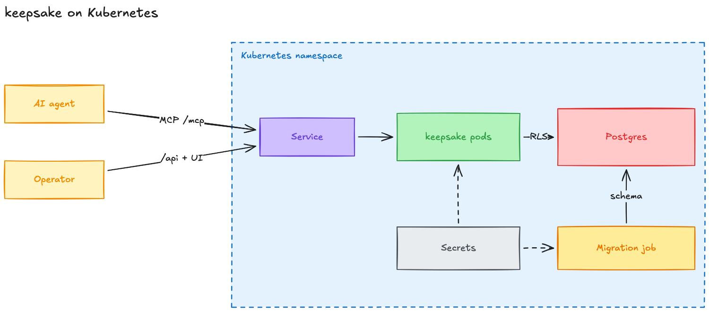

# 🧠 Keepsake

A Kubernetes-native memory substrate for fleets of agents.


## Try it

Your agents' memory is a folder of markdown. One command proves it:

```bash
git clone https://github.com/roee-fs/keepsake && cd keepsake && ./demo/run.sh
```

It needs Docker, [kind](https://kind.sigs.k8s.io/), kubectl, Helm and jq. It
installs the chart on a throwaway kind cluster and imports a 25-concept on-call
knowledge base. It exports that straight back and shows an empty diff. A scripted
agent then reads a stale runbook over MCP, fixes it, and files an incident
saying why. A second export shows exactly those changes. Then it deletes the cluster. The markdown stays.

Run it on your own notes: `./demo/run.sh ~/my-okf-bundle`. Add `--keep` to leave
the cluster up and point your own agent at it.

## Why

Agents lose everything when the context window closes. Keepsake gives them a
durable, shared knowledge base they read and write over MCP — stored in
Postgres, isolated per tenant by the database itself, and importable and
exportable as a plain [Open Knowledge Format](https://github.com/GoogleCloudPlatform/knowledge-catalog/blob/main/okf/SPEC.md)
(OKF) bundle of markdown files.

```
agent ──MCP──> keepsake ──> Postgres (RLS)
                   │
                   └── keepsake import / export ──> markdown bundle
```

## What it is

- **An MCP server.** Seven bounded tools: `okf_list`, `okf_search`, `okf_grep`,
  `okf_read`, `okf_create`, `okf_update`, `okf_relate`. Streamable HTTP, so a
  fleet of pods shares one endpoint.
- **A Postgres schema.** One row per concept, keyed `(tenant_id, path)`.
  Optimistic concurrency via an optional `expected_version`, so two agents
  editing the same concept across an LLM call cannot silently clobber each
  other — and agents editing *different* concepts never contend at all.
- **A Helm chart.** Install with a managed CloudNativePG cluster, or point it at
  a Postgres you already run and it installs into its own schema.
- **An OKF bundle on the way in and out.** The format is the interchange layer,
  not the storage layer. `keepsake export` regenerates `index.md` and `log.md` at
  export time; they are never stored, so nothing derived can drift.

## How it runs



Agents call the Service over MCP, and operators use the console through the
same Service. A Helm hook runs the migration Job before every install and
upgrade. Edit `assets/architecture.excalidraw` at [excalidraw.com](https://excalidraw.com)
and re-export the PNG when the deployment changes.

## How it differs

**Every other OKF implementation is local-first, single-user, and git-backed.**
Git works beautifully for one developer and fails for a fleet: every write
rewrites `index.md` and `log.md`, so two agents touching entirely unrelated
concepts still collide on the same files, and `index.lock` contention plus
fetch/rebase loops do the rest. Keepsake keeps derived state in the row that
owns it, or computes it at read.

**Tenancy is enforced, not filtered.** This is the real gap in the market. Mem0
takes a caller-supplied `user_id`, Zep and Graphiti take a `group_id`, and both
*filter* on it — a single mis-set id poisons a namespace permanently. The ones
that take isolation seriously escape to physical separation (a database per
tenant, a graph per tenant). Keepsake sets a Postgres GUC inside the request
transaction and lets row-level security do the enforcing. An agent never names a
tenant, so it cannot name the wrong one. The server refuses to start if it is
connected as a superuser or as the schema owner, because both silently bypass
RLS.

**No lock-in.** MIT, no hosted tier, no registry, no required runtime. Your
knowledge is markdown; `keepsake export` hands it back byte-for-byte.

## Looking at what agents stored

The chart serves a read-only admin console from the same pod and port as `/mcp`
— one image, no second Service, no CORS. Helm generates the password at
install, into a `<release>-admin` Secret:

```bash
kubectl get secret <release>-admin -o jsonpath='{.data.password}' | base64 -d
kubectl port-forward svc/<release> 8000:8000
```

Then log in at `http://localhost:8000` with that password.


## Serving many tenants

By default a release serves one tenant, `auth.fixedTenantId`, to anything that
reaches it. `auth.mode: jwt` serves many: each `/mcp` request carries an HS256
bearer token, and its `tctx.tenant` claim picks the tenant.

```bash
openssl rand -hex 32 | kubectl create secret generic keepsake-jwt --from-file=secrets=/dev/stdin
helm install keepsake charts/keepsake --set auth.mode=jwt \
  --set auth.jwt.issuer=platform --set auth.jwt.existingSecret=keepsake-jwt
```

Your orchestrator holds the same secret and signs a short-lived token per call:
`{"iss": "platform", "aud": "keepsake", "sub": "run:42", "tctx": {"tenant": "<uuid>"}, "exp": …}`.
The secret MUST NOT be readable by anything an LLM drives. A client that can run
code, or that only takes a static header, gets a token for its own tenant instead:

```bash
kubectl exec deploy/keepsake -- keepsake token --tenant <uuid> --sub alice --ttl 720h
```

## Roadmap

**v1 — the substrate**

- [x] `okf`: OKF parse/serialize with round-trip fidelity
- [x] Link extraction and per-write validation
- [x] Schema migration: concepts, revisions, RLS policies, tenant purge
- [x] Tenant-scoped connection handling
- [x] Writes with optional compare-and-swap and an append-only revision log
- [x] Read paths: read, list, search, grep, backlinks
- [x] Startup verification that refuses a privileged database role
- [x] MCP server over streamable HTTP
- [x] CLI: import, export, validate, migrate, serve
- [x] Helm chart with managed and existing Postgres modes
- [x] kind end-to-end suite
- [x] Tool arguments validated against their advertised schemas, so a bad one is
      something the agent can correct rather than a transport failure
- [x] Concurrent writes served in parallel, with readiness that follows the
      database rather than the bound port

**Next**

- [x] `jwt` auth mode: one release serves many tenants, each request's tenant
      taken from a signed token
- [ ] OIDC and Kubernetes ServiceAccount tokens for `jwt` mode, verified against
      the issuer's published keys
- [x] A review UI over what agents believe — the thing `git diff` gave OKF for
      free and every hosted memory product dropped
- [ ] Semantic search (pgvector + reciprocal rank fusion over the lexical index)
- [ ] Revision retention and pruning policy
- [ ] Per-tenant rate limits
- [ ] Deduplication, contradiction resolution, staleness lifecycle

## Status

Pre-release. Nothing here is stable yet.

## Docs

- [`CHANGELOG.md`](CHANGELOG.md) — what changed, newest first

## Contributing

[`CONTRIBUTING.md`](CONTRIBUTING.md) has the setup, the checks CI runs, and what
a good change looks like. `go test ./...` is the whole loop; the tests bring up
PostgreSQL in a container themselves.

Found something touching tenant isolation? [`SECURITY.md`](SECURITY.md) — report
it privately, not as an issue.

Participation is covered by the [Code of Conduct](CODE_OF_CONDUCT.md).

## License

MIT — see [`LICENSE`](LICENSE).
