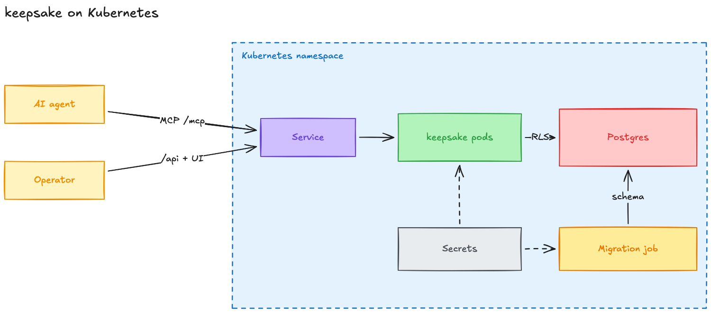

# 🧠 Keepsake

**Shared memory for fleets of agents.**

[](LICENSE)
[](CHANGELOG.md)

Keepsake gives agents a durable, shared knowledge base they read and write over
MCP. It runs on Kubernetes, stores memory in Postgres, isolates tenants with
row-level security, and imports and exports plain markdown in the
[Open Knowledge Format](https://github.com/GoogleCloudPlatform/knowledge-catalog/blob/main/okf/SPEC.md)
(OKF).

MIT licensed. Self-hosted. Kubernetes-native.

[Demo](#see-it-work) ·
[Deploy guide](docs/deploy.md) ·
[MCP tools](docs/tools.md) ·
[Operations](docs/operations.md) ·
[llms.txt](llms.txt)

## Ask an agent to evaluate it

```text
Read https://raw.githubusercontent.com/roee-fs/keepsake/main/llms.txt and explain how keepsake would fit my current agent setup. If it fits, set it up with me.
```

[`llms.txt`](llms.txt) holds the same product and setup information in plain text.

## Why keepsake

Agents lose everything when the context window closes. A file or a wiki carries
content, and nothing else. It does not keep two agents from overwriting each
other, it does not know which tenant a line belongs to, and nobody reviews what
agents wrote into it.

What keepsake provides:

- **An MCP server.** Seven bounded tools: `okf_list`, `okf_search`, `okf_grep`,
  `okf_read`, `okf_create`, `okf_update`, `okf_relate`. Streamable HTTP, so a
  fleet of pods shares one endpoint.
- **Safe concurrent writes.** One row per concept, keyed `(tenant_id, path)`.
  Optimistic concurrency via an optional `expected_version`, so two agents
  editing the same concept across an LLM call cannot silently clobber each
  other — and agents editing *different* concepts never contend at all.
- **Tenancy the database enforces.** Row-level security picks the tenant from
  the request. An agent never names a tenant, so it cannot name the wrong one.
- **A Helm chart.** Install with a managed CloudNativePG cluster, or point it at
  a Postgres you already run and it installs into its own schema.
- **An OKF bundle on the way in and out.** The format is the interchange layer,
  not the storage layer. `keepsake export` regenerates `index.md` and `log.md` at
  export time; they are never stored, so nothing derived can drift.
- **A console.** Operators review what agents stored, and who wrote it.

```
agent ──MCP──> keepsake ──> Postgres (RLS)
                   │
                   └── keepsake import / export ──> markdown bundle
```

## See it work


What one agent learns, the next one knows. One command shows it:

```bash
git clone https://github.com/roee-fs/keepsake && cd keepsake && ./demo/run.sh
```

It needs Docker, [kind](https://kind.sigs.k8s.io/), kubectl, Helm, jq and a
logged-in [Claude Code](https://docs.claude.com/en/docs/claude-code/setup).
It installs the chart on a throwaway kind cluster and imports
an on-call team's knowledge base. Agent A asks who to page before a Postgres
failover and gets a stale answer. Agent B, which just ran a failover drill, records
what it learned. Agent A asks again in a new session and gets the right answer and
the reason. The agents are real Claude sessions whose only memory is keepsake, over
MCP. Then it deletes the cluster.

Add `--keep` to leave the cluster up and point your own agent at it.

## Try keepsake

### Local

On your machine, with Docker only:

```bash
docker compose up -d
claude mcp add --transport http keepsake http://localhost:8000/mcp
```

The console is at `http://localhost:8000`, password `keepsake`. Load a bundle with
`docker compose run --rm -v "$PWD/demo/bundle:/bundle:ro" keepsake keepsake import /bundle`.
This setup is for trying keepsake out. It serves one tenant to anything that
reaches the port.

### Kubernetes

```bash
helm install keepsake oci://ghcr.io/roee-fs/charts/keepsake --version 0.4.0
```

This also serves one tenant to anything that reaches the Service. For your own
Postgres and many tenants, follow the [deploy guide](docs/deploy.md).

## Connect your agents

- **Claude Code:** `claude mcp add --transport http keepsake <url>/mcp`.
- **Any MCP client** that speaks streamable HTTP points at `/mcp`.
- **A client that can run code, or that only takes a static header,** gets a
  token for its own tenant:

  ```bash
  kubectl exec deploy/keepsake -- keepsake token --tenant <uuid> --sub human:alice --ttl 720h
  ```

The server sends the agent `instructions` with the tools: search before
answering, follow links, and update rather than duplicate.
[`docs/tools.md`](docs/tools.md) covers each tool's arguments and results.

## How keepsake relates to other tools

- **Model provider memory** (Claude memory tool, OpenAI Agents SDK sessions,
  Bedrock AgentCore Memory) is the fastest path inside one provider's stack.
  The memory takes that provider's shape, so leaving means migrating it.
  Keepsake stores markdown any agent can read.
- **Memory products** (Mem0, Zep and Graphiti, Letta) extract facts from
  conversations for you. Mem0 takes a caller-supplied `user_id`, Zep and
  Graphiti take a `group_id`, and both *filter* on it — a single mis-set id
  poisons a namespace permanently. Keepsake sets a Postgres GUC inside the
  request transaction and lets row-level security do the enforcing.
- **Databases with memory features** (Redis, MongoDB, SurrealDB) leave the
  memory model, tools, tenancy and review UI to you.
- **Local and custom tools** serve one developer or one repo, not a fleet
  across tenants.

[`docs/alternatives.md`](docs/alternatives.md) says when to choose each instead.

## Tenancy and authority

| Decision | Simple option | Production option |
| --- | --- | --- |
| Who picks the tenant | `auth.mode: none`. One tenant, `auth.fixedTenantId`, for anything that reaches the port. | `auth.mode: jwt`. A signed token per request. Its `tctx.tenant` claim picks the tenant. |
| Where data lives | `postgres.mode: managed`. A CloudNativePG cluster the chart creates. | `postgres.mode: existing`. Your Postgres, in its own `okf` schema. |
| Who signs tokens | `keepsake token`, for a client that takes a static header. | Your orchestrator, with a short-lived token per call. |

In `jwt` mode each `/mcp` request carries an HS256 bearer token. Your
orchestrator holds the signing secret. The HMAC key is the line's text as-is,
not its hex-decoded bytes:
`{"iss": "platform", "aud": "keepsake", "sub": "support-agent/1.4", "tctx": {"tenant": "<uuid>"}, "exp": …}`.
keepsake records `sub` as the writer, and stamps it as OKF `generated.by` on every
concept the token writes through `/mcp`. It SHOULD follow the OKF actor convention,
and MUST be `human:<id>` for a person.
The secret MUST NOT be readable by anything an LLM drives.

The server refuses to start if it is connected as a superuser or as the schema
owner, because both silently bypass RLS.

## How it works



Agents call the Service over MCP, and operators use the console through the
same Service. A Helm hook runs the migration Job before every install and
upgrade.

### Versioning

Every write gives a concept a new `version`, drawn from one sequence that never
repeats. It only grows, and gaps are normal. Every write also appends a
revision: who wrote what, and when. Deletes are revisions too, so a deleted
concept's history stays readable.

To edit safely, an agent passes the `version` it read back as
`expected_version`. If anyone wrote the concept since, the write changes nothing
and the agent gets the current version and body to merge against. An import
skips unchanged concepts, so pushing the same bundle twice changes nothing.

### The console

The chart serves a read-only admin console from the same pod and port as `/mcp`
— one image, no second Service, no CORS. Helm generates the password at
install, into a `<release>-admin` Secret:

```bash
kubectl get secret <release>-admin -o jsonpath='{.data.password}' | base64 -d
kubectl port-forward svc/<release> 8000:8000
```

Then log in at `http://localhost:8000` with that password.


## What is in this repository

| Path | Responsibility |
| --- | --- |
| `cmd/keepsake` | The one binary: `serve`, `migrate`, `import`, `export`, `validate`, `token`. |
| `internal/server` | The MCP server, the console API and auth. |
| `internal/store` | Tenant-scoped reads and writes, search, and the revision log. |
| `internal/migrate` | The schema, RLS policies and grants. |
| `internal/cli` | The CLI commands. |
| `okf/` | OKF parsing, serialization, links and validation. |
| `frontend/` | The console, embedded in the binary. |
| `charts/keepsake` | The Helm chart. |
| `demo/` | The two-agent demo and its bundle. |
| `e2e/`, `tests/` | The kind end-to-end suite and the chart and release checks. |
| `bench/` | Search quality and speed benchmarks. |

## Documentation

- [`docs/deploy.md`](docs/deploy.md) — install into your Postgres and serve many tenants
- [`docs/tools.md`](docs/tools.md) — the MCP tools, their arguments and results
- [`docs/operations.md`](docs/operations.md) — install, roles, upgrades, backups
- [`docs/alternatives.md`](docs/alternatives.md) — when to use something else
- [`CHANGELOG.md`](CHANGELOG.md) — what changed, newest first
- [`bench/benchmarks.pdf`](bench/benchmarks.pdf) — search quality against speed, measured

## Current limitations

- Pre-release. Nothing here is stable yet.
- `jwt` mode verifies HS256 tokens with a shared secret only. OIDC and
  Kubernetes ServiceAccount tokens are not supported yet.
- Search is lexical (BM25). There is no semantic search yet.
- Nothing prunes revisions, and there are no per-tenant rate limits.
- Keepsake does not deduplicate concepts or resolve contradictions.
- The chart configures no backups. See [`docs/operations.md`](docs/operations.md#backups).

## Contributing

[`CONTRIBUTING.md`](CONTRIBUTING.md) has the setup, the checks CI runs, and what
a good change looks like. `go test ./...` is the whole loop; the tests bring up
PostgreSQL in a container themselves.

Found something touching tenant isolation? [`SECURITY.md`](SECURITY.md) — report
it privately, not as an issue.

Participation is covered by the [Code of Conduct](CODE_OF_CONDUCT.md).

## License

MIT — see [`LICENSE`](LICENSE).
